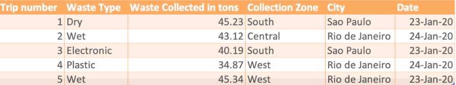

# Solid Waste Management Data Warehouse Project
## Overview

This project focuses on designing and implementing a data warehouse for a solid waste management company operating in major cities across Brazil. The company's goal is to create a data warehouse that allows for comprehensive reporting on waste collection metrics, including total waste collected by various dimensions such as year, month, truck type, and city.

## Index

1. [Project Structure](#project-structure)
2. [Design and Schema](#design-and-schema)
   - [Initial Design](#initial-design)
   - [Reason for Change](#reason-for-change)
   - [Revised Design](#revised-design)
3. [Schema Creation](#schema-creation)
   - [Schema Creation Script (`01-schema.sql`)](#schema-creation-script-01-schemasql)
4. [Data Loading](#data-loading)
   - [Data Loading Script (`02-load_data.sql`)](#data-loading-script-02-load_datasql)
5. [Materialized View](#materialized-view)
   - [Materialized View Creation Script (`03-materialized-view.sql`)](#materialized-view-creation-script-03-materialized-viewsql)
6. [Docker Setup](#docker-setup)
   - [Docker Compose (`docker-compose.yml`)](#docker-compose-docker-composeyml)
   - [Starting the Services](#starting-the-services)
7. [Screenshots](#screenshots)
8. [Learning Objectives](#learning-objectives)
9. [License](#license)


## Project Structure
```
project-folder/
├── first-design/
│   ├── MyDimDate-dev.txt
│   ├── MyDimWaste-dev.txt
│   ├── MyDimZone-dev.txt
│   └── MyFactTrips-dev.txt
├── images/
│   └── data-sample.png
├── postgresql/
│   ├── csv-files/
│   │   ├── DimDate.csv
│   │   ├── DimTruck.csv
│   │   ├── DimStation.csv
│   │   └── FactTrips.csv
│   │
│   ├── final-project/
│   │   ├── 01-schema.sql
│   │   ├── 02-load_data.sql
│   │   └── 03-materialized-view.sql
│   └── docker-compose.yml
```

## Design and Schema

### Initial Design

The solid waste management company provided a sample dataset that they initially wanted to collect. The sample included the relevant fields for different dimensions such as date, waste type, and zone, as well as the trips. Below is the sample data provided by the company, which guided the initial design.



The initial design used a Star Schema with the following tables:

#### MyDimDate:
*   dateid (INT): Unique identifier for each date.
*   date (DATE): Actual date value.
*   year (INT): Year of the date.
*   quarter (INT): Quarter of the year (1 to 4).
*   quarterName (VARCHAR(2)): Name of the quarter (e.g., 'Q1', 'Q2').
*   month (INT): Month of the year (1 to 12).
*   monthname (VARCHAR(9)): Name of the month (e.g., 'January').
*   day (INT): Day of the month (1 to 31).
*   weekday (INT): Day of the week (0 for Sunday, 1 for Monday, etc.).
*   weekdayName (VARCHAR(9)): Name of the day of the week (e.g., 'Monday').

#### MyDimWaste:
* wasteid (INT): Unique identifier for each waste type.
* type (VARCHAR(10)): Type of waste.

#### MyDimZone:
* zoneid (INT): Unique identifier for each collection zone.
* zone (VARCHAR(10)): Name of the zone.
* city (VARCHAR(50)): City where the zone is located.

#### MyFactTrips:
* tripnumber (INT): Unique identifier for each waste collection trip.
* waste_collected_in_tons (FLOAT): Amount of waste collected during the trip.
* type_id (INT): Foreign key referencing MyDimWaste(wasteid).
* zone_id (INT): Foreign key referencing MyDimZone(zoneid).
* date_id (INT): Foreign key referencing MyDimDate(dateid).

#### Reason for Change
The initial design faced issues due to operational constraints and changes in data collection formats. The company provided data in different formats than initially planned, requiring a new schema design. The revised design incorporates new tables (DimTruck and DimStation) and updated attributes to better reflect the company's data collection and reporting needs.

### Revised Design

The revised schema includes:

### 1. Updated Dimension Tables:

#### DimDate:
* dateid (INT): Unique identifier for each date.
* date (DATE): Actual date value.
* year (INT): Year of the date.
* month (INT): Month of the year (1 to 12).
* monthname (VARCHAR(20)): Name of the month.
* quarter (INT): Quarter of the year (1 to 4).
* quarterName (VARCHAR(2)): Name of the quarter.
* day (INT): Day of the month (1 to 31).
* weekday (INT): Day of the week (0 for Sunday, 1 for Monday, etc.).
* weekdayName (VARCHAR(20)): Name of the day of the week.

#### DimTruck:
* truckid (INT): Unique identifier for each truck.
* truckType (VARCHAR(20)): Type of the truck.

#### DimStation:
* stationid (INT): Unique identifier for each station.
* city (VARCHAR(50)): City where the station is located.

### 2. Updated Fact Table:

#### FactTrips:
* tripid (INT): Unique identifier for each waste collection trip.
* dateid (INT): Foreign key referencing DimDate(dateid).
* stationid (INT): Foreign key referencing DimStation(stationid).
* truckid (INT): Foreign key referencing DimTruck(truckid).
* wastecollected (DECIMAL(5,2)): Amount of waste collected during the trip.

### 3. Materialized View:
* max_waste_status: Provides insights into the maximum waste collected by city, station, and truck type.

## Schema Creation

### Schema Creation Script (01-schema.sql)
```sql
-- Creating DimDate table
CREATE TABLE IF NOT EXISTS DimDate (
    dateid INT PRIMARY KEY,
    date DATE,
    year INT,
    quarter INT,
    quarterName VARCHAR(2),
    month INT,
    monthname VARCHAR(20),
    day INT,
    weekday INT,
    weekdayName VARCHAR(20)
);

-- Creating DimTruck table
CREATE TABLE IF NOT EXISTS DimTruck(
    truckid INT PRIMARY KEY,
    truckType VARCHAR(20)
);

-- Creating DimStation table
CREATE TABLE IF NOT EXISTS DimStation(
    stationid INT PRIMARY KEY,
    city VARCHAR(50)
);

-- Creating FactTrips table with foreign key constraints
CREATE TABLE IF NOT EXISTS FactTrips(
    tripid INT PRIMARY KEY,
    dateid INT,
    stationid INT,
    truckid INT,
    wastecollected DECIMAL(5,2),
    FOREIGN KEY (dateid) REFERENCES DimDate(dateid),
    FOREIGN KEY (stationid) REFERENCES DimStation(stationid),
    FOREIGN KEY (truckid) REFERENCES DimTruck(truckid)
);
```

## Data Loading

### Data Loading Script (02-load_data.sql)

```sql
-- Loading DimDate data from CSV
COPY DimDate (dateid, date, year, quarter, quarterName, month, monthname, day, weekday, weekdayName)
FROM '/csv-files/DimDate.csv' 
DELIMITER ',' 
CSV HEADER;

-- Loading DimTruck data from CSV
COPY DimTruck (truckid, truckType)
FROM '/csv-files/DimTruck.csv' 
DELIMITER ',' 
CSV HEADER;

-- Loading DimStation data from CSV
COPY DimStation (stationid, city)
FROM '/csv-files/DimStation.csv' 
DELIMITER ',' 
CSV HEADER;

-- Loading FactTrips data from CSV
COPY FactTrips (tripid, dateid, stationid, truckid, wastecollected)
FROM '/csv-files/FactTrips.csv' 
DELIMITER ',' 
CSV HEADER;
```

## Materialized View

### Materialized View Creation Script (03-materialized-view.sql)

```sql
CREATE MATERIALIZED VIEW max_waste_status AS
SELECT d.year, s.city, f.stationid, t.truckType, MAX(f.wastecollected) as max_waste_collected
FROM FactTrips f
INNER JOIN DimDate d ON f.dateid = d.dateid
INNER JOIN DimStation s ON f.stationid = s.stationid
INNER JOIN DimTruck t ON f.truckid = t.truckid
GROUP BY d.year, s.city, f.stationid, t.truckType;
```

## Docker Setup

### Docker Compose (docker-compose.yml)

```yml
version: '3'
services:
  postgres:
    image: postgres:13
    container_name: postgres_db
    environment:
      POSTGRES_USER: admin
      POSTGRES_PASSWORD: admin123
      POSTGRES_DB: solid_waste_management
    volumes:
      - postgres_data:/var/lib/postgresql/data
      - ./final-project:/docker-entrypoint-initdb.d
      - ./csv-files:/csv-files
    ports:
      - "5432:5432"

  pgadmin:
    image: dpage/pgadmin4
    container_name: pgadmin
    environment:
      PGADMIN_DEFAULT_EMAIL: admin@admin.com
      PGADMIN_DEFAULT_PASSWORD: admin123
    ports:
      - "8080:80"
    depends_on:
      - postgres

volumes:
  postgres_data:
```

## Starting the Services
1. Navigate to the /postgresql directory.

2. Run:
    ```bash
    docker-compose up -d
    ```
3. Access PgAdmin at http://localhost:8080 with:
* Email: admin@admin.com
* Password: admin123